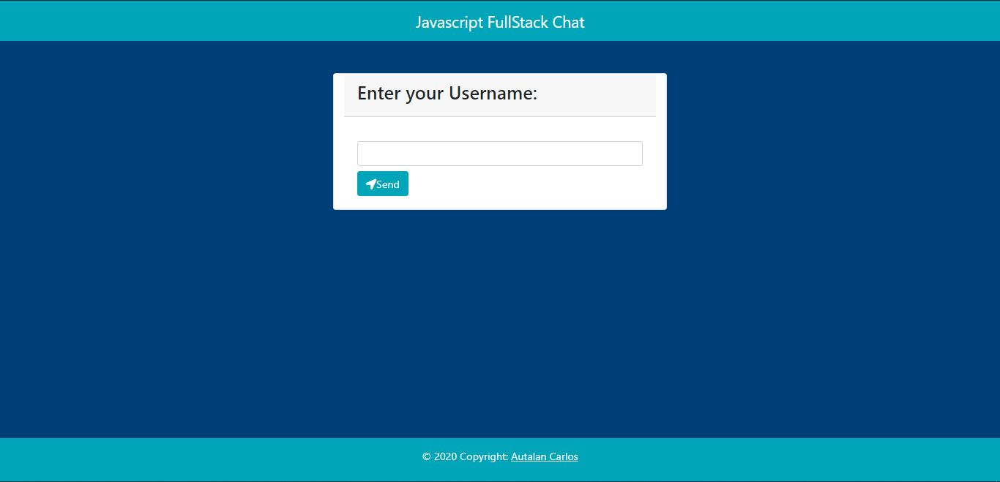
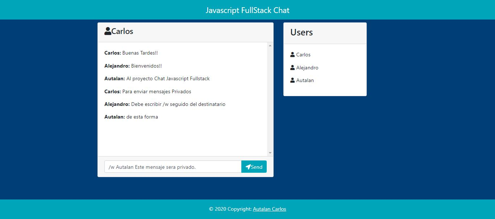

# Chat AleCharl
Desarrollo de un chat básico con Tecnologías JavaScript

## Tecnologias 
En este proyecto se ha utilizado NodeJs, Bootstrap, MongoDB y Jquery.

## repositorio
Visita <https://github.com/alecharl/Chat-Alecharl> para ver el código del proyecto

## Demo
Visita [Chat-Alecharl-Heroku](https://chat-alecharl.herokuapp.com/) para ver la aplicación funcionando.

## Preview

### Login

### Chat

### Mensajes Privados

